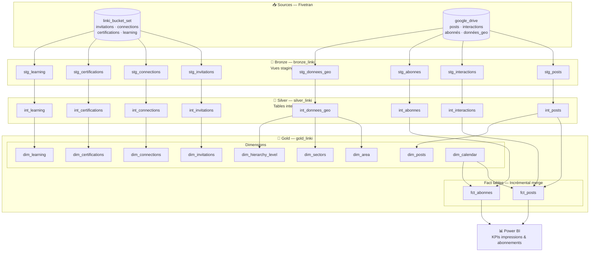
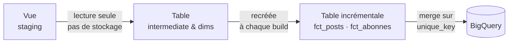
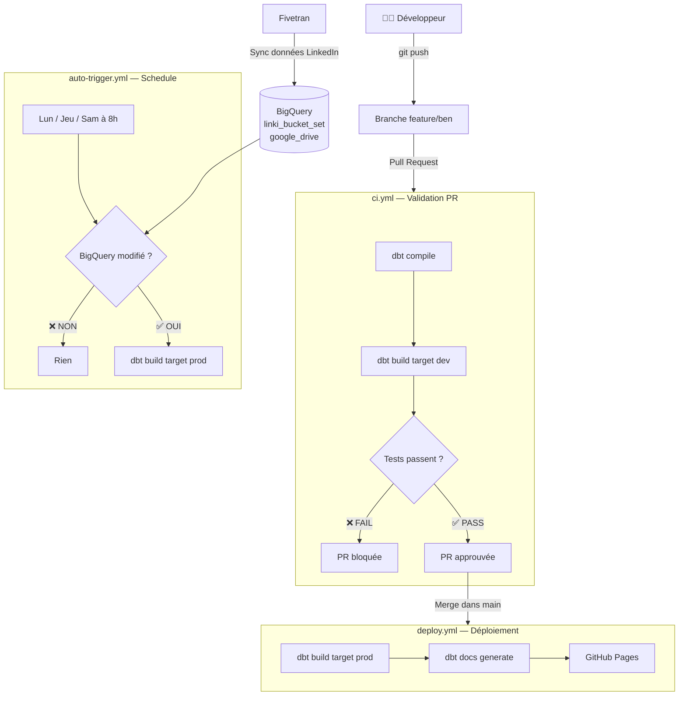
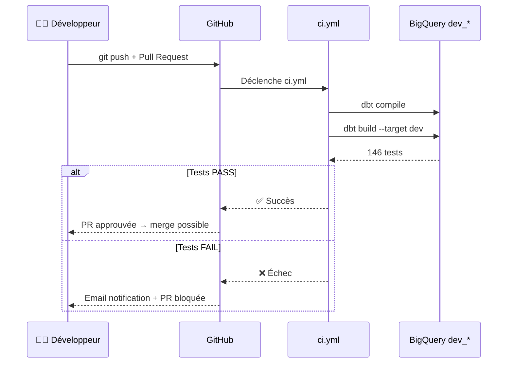
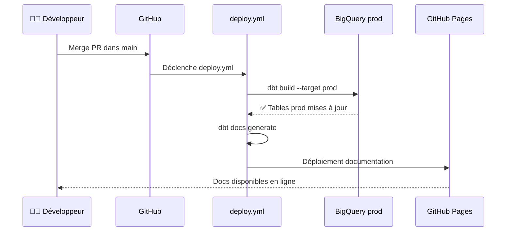
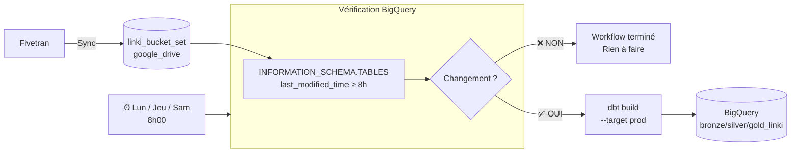
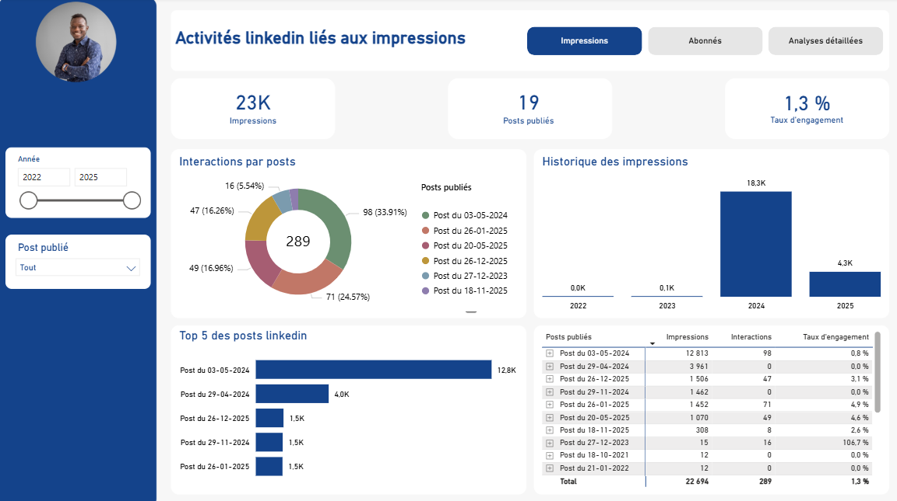

# LinkyHub dbt — Ben Mbairo

Pipeline analytique dbt transformant les données LinkedIn en KPIs visualisés sur Power BI, hébergé sur BigQuery.

---

## Table des matières

1. [Architecture](#architecture)
2. [Sources de données](#sources-de-données)
3. [Modèles](#modèles)
4. [Qualité des données](#qualité-des-données)
5. [Packages & macros](#packages--macros)
6. [Installation & configuration](#installation--configuration)
7. [Commandes](#commandes)
8. [CI/CD](#cicd)
9. [Bonnes pratiques](#bonnes-pratiques)
10. [Limites & évolutions futures](#limites--évolutions-futures)
11. [Power BI](#power-bi)

---

## Architecture

```
Sources (Fivetran)
      ↓
Bronze — bronze_linki   →  Vues staging (données brutes nettoyées)
      ↓
Silver — silver_linki   →  Tables intermédiaires (normalisées, dédupliquées)
      ↓
Gold   — gold_linki     →  Tables analytiques finales (dims & facts)
      ↓
Power BI                →  Rapport de visualisation des KPIs LinkedIn
```

Les schemas sont séparés par environnement :

| Environnement | Schemas |
|---|---|
| Local (`dev`) | `dev_bronze_linki`, `dev_silver_linki`, `dev_gold_linki` |
| Production (`prod`) | `bronze_linki`, `silver_linki`, `gold_linki` |

### Flux complet des données



### Clés surrogates

Toutes les dimensions et facts utilisent `FARM_FINGERPRINT` pour générer des clés uniques :

```sql
FARM_FINGERPRINT(CONCAT(champ1, '|', champ2)) AS id_model
```

### Matérialisation



---

## Sources de données

Données synchronisées via **Fivetran** :

| Source BigQuery | Tables |
|---|---|
| `linki_bucket_set` | invitations, connections, certifications, learning |
| `google_drive` | posts, interactions, abonnés, données démographiques |

---

## Modèles

| Couche | Schéma | Modèles | Matérialisation |
|---|---|---|---|
| Staging | `bronze_linki` | `stg_posts`, `stg_connections`, `stg_invitations`, `stg_certifications`, `stg_learning`, `stg_abonnes`, `stg_interactions`, `stg_donnees_geo` | Vue |
| Intermediate | `silver_linki` | `int_posts`, `int_connections`, `int_invitations`, `int_certifications`, `int_learning`, `int_abonnes`, `int_interactions`, `int_donnees_geo` | Table |
| Marts | `gold_linki` | `fct_posts`, `fct_abonnes`, `dim_posts`, `dim_connections`, `dim_invitations`, `dim_certifications`, `dim_learning`, `dim_area`, `dim_sectors`, `dim_hierarchy_level`, `dim_calendar` | Table / Incrémental |

**Fact tables :** `fct_posts` et `fct_abonnes` sont en mode incrémental (`merge` strategy).

---

## Qualité des données

146 tests automatisés couvrant :

- **Unicité** — clés surrogates (`id_*`) sur tous les modèles
- **Non-nullité** — colonnes critiques
- **Valeurs acceptées** — ex: direction `OUTGOING` / `INCOMING`
- **Plages numériques** — impressions, interactions, pourcentages
- **Intégrité référentielle** — facts → dimensions
- **Format** — emails et URLs LinkedIn (regex)

---

## Packages & macros

### Packages externes

| Package | Version | Utilisation |
|---|---|---|
| `dbt-labs/dbt_utils` | 1.1.1 | Utilitaires SQL : génération de clés surrogates, tests génériques |
| `metaplane/dbt_expectations` | 0.10.10 | Tests avancés : plages de valeurs, types de données, expressions régulières |

### Macros custom

#### `normalize_email`
Normalise une adresse email en minuscules et supprime les espaces.
```sql
{{ normalize_email('email_address') }}
-- équivalent à : LOWER(TRIM(email_address))
```
Utilisée dans : `int_connections`, `dim_connections`

#### `generate_date_spine`
Génère une séquence de dates entre deux bornes via `GENERATE_DATE_ARRAY` BigQuery.
```sql
{{ generate_date_spine('2021-01-01', '2027-12-31') }}
```
Utilisée dans : `dim_calendar`

#### `generate_schema_name`
Contrôle le nom du schema selon l'environnement.
- En `dev` → préfixe `dev_` (ex: `dev_bronze_linki`)
- En `prod` → nom direct (ex: `bronze_linki`)

---

## Installation & configuration

### Prérequis

- Python 3.12+
- Accès BigQuery (projet `prime-force-478609-s4`)
- Service account JSON GCP

### Installation

```bash
# Créer et activer l'environnement virtuel
python -m venv .venv
source .venv/bin/activate  # Linux/Mac
.venv\Scripts\activate     # Windows

# Installer les dépendances
pip install dbt-bigquery>=1.11.0

# Installer les packages dbt
dbt deps
```

### Configuration

Le fichier `~/.dbt/profiles.yml` doit contenir :

```yaml
linkyhub_dbt:
  target: dev
  outputs:
    dev:
      type: bigquery
      method: service-account
      project: prime-force-478609-s4
      dataset: DEV
      location: US
      threads: 4
      keyfile: /chemin/vers/service-account.json
```

---

## Commandes

### Développement local

```bash
# Compiler le SQL (vérifie la syntaxe sans toucher BigQuery)
dbt compile

# Builder tous les modèles + tests
dbt build

# Builder un modèle spécifique + ses dépendants
dbt build --select fct_posts+

# Builder uniquement la couche staging
dbt build --select staging

# Lancer uniquement les tests
dbt test

# Recréer les modèles incrémentaux from scratch
dbt build --full-refresh

# Nettoyer les fichiers compilés
dbt clean

# Générer et ouvrir la documentation en local
dbt docs generate
dbt docs serve
```

### CI/CD (GitHub Actions)

```bash
# CI — validation sur Pull Request
dbt compile --profiles-dir . --target dev
dbt build --profiles-dir . --target dev

# Deploy — déploiement en production
dbt build --profiles-dir . --target prod
dbt docs generate --profiles-dir . --target prod --select "path:models"
```

---

## CI/CD

Trois workflows GitHub Actions :

| Workflow | Déclencheur | Actions |
|---|---|---|
| `ci.yml` | Pull Request vers `main` | compile + build + 146 tests (target dev) |
| `deploy.yml` | Push/merge dans `main` | build prod + génération docs GitHub Pages |
| `auto-trigger.yml` | Lun, Jeu, Sam à 8h | polling BigQuery → build prod si données changées |

### Vue d'ensemble



### Workflow CI — Pull Request



### Workflow Deploy — Merge dans main



### Workflow Auto-trigger — Schedule BigQuery



### Secrets requis

| Secret | Description |
|---|---|
| `GCP_SERVICE_ACCOUNT_KEY` | Contenu JSON du service account GCP |

### Documentation

La documentation dbt est générée automatiquement et publiée sur GitHub Pages à chaque merge dans `main`.

---

## Bonnes pratiques

- **Clés surrogates** : utilisation de `FARM_FINGERPRINT(CONCAT(...))` sur toutes les dimensions et facts
- **Déduplication** : `QUALIFY ROW_NUMBER() OVER (...) = 1` en couche intermediate
- **Modèles incrémentaux** : `fct_posts` et `fct_abonnes` en `merge` pour éviter les rechargements complets
- **Séparation dev/prod** : la macro `generate_schema_name` préfixe `dev_` en local, sans préfixe en prod
- **Tests systématiques** : chaque modèle a au minimum des tests `not_null` et `unique` sur ses clés
- **Packages externes cachés** : `dbt_utils` et `dbt_expectations` filtrés de la documentation publiée

---

## Limites & évolutions futures

### Limites actuelles

- **CI et dev sur les mêmes schemas** : le CI utilise le target `dev`, ce qui peut causer des conflits si un build local tourne en même temps
- **Pas de target staging** : les données prod ne sont pas validées sur un environnement miroir avant déploiement
- **dim_calendar hardcodée** : plage fixe 2021-2027, à mettre à jour manuellement
- **Pas de snapshots** : les changements historiques sur les dimensions ne sont pas trackés

### Évolutions recommandées

- **Ajouter un target `staging`** dans `auto-trigger.yml` : `dbt build staging → si OK → dbt build prod` pour protéger la prod des données mal formatées
- **Ajouter un target `ci` dédié** pour isoler complètement les builds CI des builds locaux
- **Notifications Slack** en cas d'échec CI/CD lorsqu'il s'agit d'une équipe
- **Snapshots** sur `dim_connections` pour tracker les évolutions dans le temps
- **Tests SQL custom** dans `/tests` pour les règles métier complexes

---

## Power BI

Le rapport Power BI consomme les tables de la couche Gold (`gold_linki`) pour visualiser les KPIs LinkedIn.

**KPIs suivis :**
- Évolution des impressions par post
- Évolution des abonnements dans le temps
- Performance des interactions (likes, commentaires, partages)
- Analyse démographique des abonnés (zones géographiques, secteurs, niveaux hiérarchiques)


