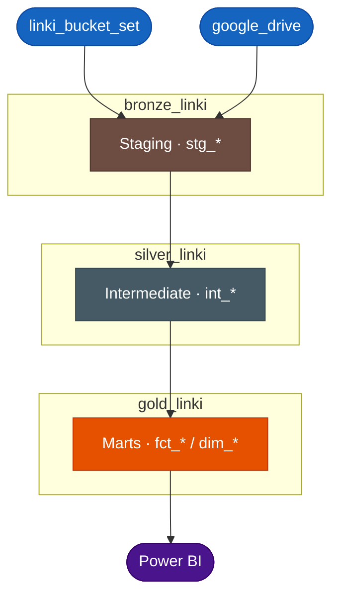



# Bienvenue sur la documentation LinkyHub — Ben Mbairo

Ce projet dbt transforme les données **LinkedIn** en un pipeline analytique structuré et documenté, hébergé sur **BigQuery**.

---

## Table des matières

| # | Section |
|---|---|
| 1 | Flux complet des données |
| 2 | Objectif |
| 3 | Sources de données |
| 4 | Modèles |
| 5 | Clés surrogates |
| 6 | Qualité des données |
| 7 | Power BI |
| 8 | CI/CD |
| 9 | Navigation |

---

## Flux complet des données



| Couche | Schéma | Matérialisation | Rôle |
|---|---|---|---|
| Bronze | `bronze_linki` | Vues | Données brutes nettoyées |
| Silver | `silver_linki` | Tables | Normalisées, dédupliquées |
| Gold | `gold_linki` | Tables / Incrémental | Dims & facts prêts pour Power BI |

---

## Objectif

Alimenter un **rapport Power BI** permettant de visualiser les KPIs liés aux **impressions** et aux **abonnements** du profil LinkedIn de Ben Mbairo, afin de suivre et d'analyser la performance de sa présence sur la plateforme.

---

## Sources de données

| Source BigQuery | Alimentation | Tables |
|---|---|---|
| `linki_bucket_set` | Dépôt manuel | invitations, connections, certifications, learning |
| `google_drive` | Fivetran (sync automatique) | posts, interactions, abonnés, données démographiques |

---

## Modèles

| Couche | Schéma | Nombre de modèles | Type |
|---|---|---|---|
| Staging | `bronze_linki` | 8 | Vues |
| Intermediate | `silver_linki` | 8 | Tables |
| Marts | `gold_linki` | 11 | Tables / Incrémental |

**Fact tables :** `fct_posts`, `fct_abonnes`

**Dimensions :** `dim_posts`, `dim_connections`, `dim_invitations`, `dim_certifications`, `dim_learning`, `dim_area`, `dim_sectors`, `dim_hierarchy_level`, `dim_calendar`

---

## Clés surrogates

Toutes les dimensions et facts utilisent `FARM_FINGERPRINT` pour générer des clés uniques :

```sql
FARM_FINGERPRINT(CONCAT(champ1, '|', champ2)) AS id_model
```

---

## Qualité des données

**146 tests automatisés** couvrant :

- Unicité et non-nullité des clés surrogates (`id_*`)
- Valeurs acceptées (ex: direction `OUTGOING` / `INCOMING`)
- Plages de valeurs numériques (impressions, interactions, pourcentages)
- Intégrité référentielle entre facts et dimensions
- Validation de formats (emails, URLs LinkedIn)

---

## Power BI

Le rapport Power BI consomme les tables de la couche Gold (`gold_linki`) pour visualiser les KPIs LinkedIn.

**KPIs suivis :**
- Évolution des impressions par post
- Évolution des abonnements dans le temps
- Performance des interactions (likes, commentaires, partages)
- Analyse démographique des abonnés (zones géographiques, secteurs, niveaux hiérarchiques)


---

## CI/CD

| Workflow | Déclencheur | Actions |
|---|---|---|
| `ci.yml` | Pull Request vers `main` | compile + build + tests (target dev) |
| `auto-merge.yml` | PR ouverte / réouverte vers `main` | active le flag `--auto` — GitHub merge automatiquement une fois `dbt-ci` passé |
| `deploy.yml` | Merge dans `main` | build prod + docs GitHub Pages |
| `auto-trigger.yml` | Lun, Jeu, Sam à 8h | polling BigQuery → build prod si données changées |

Les dépendances sont gérées via **uv** pour des installations rapides sur les runners GitHub.

---

## Navigation

- **Project** : explore les modèles par couche (staging → intermediate → marts)
- **Database** : explore les tables par schéma BigQuery
- **Lineage graph** : visualise les dépendances entre modèles (icône bleue en bas à droite)

